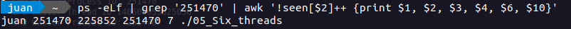
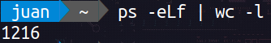
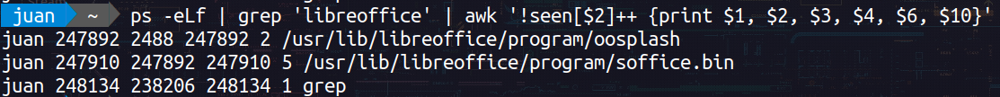
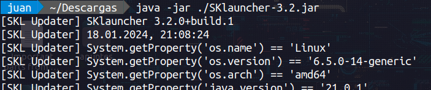
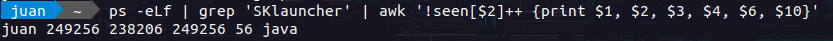
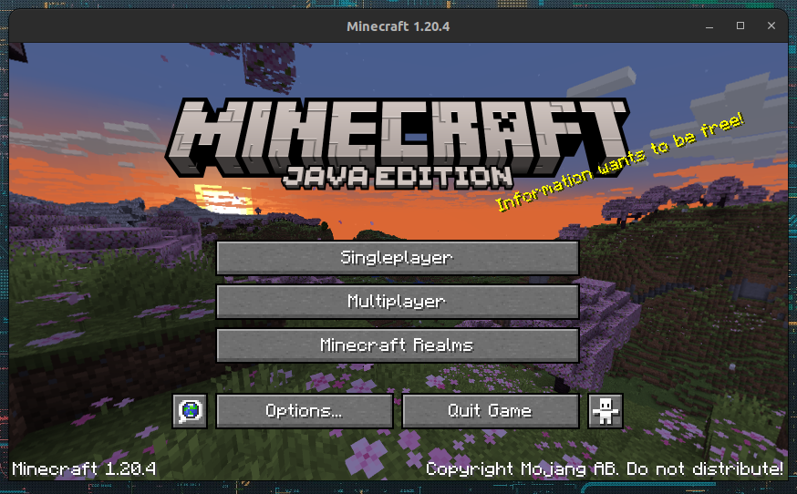
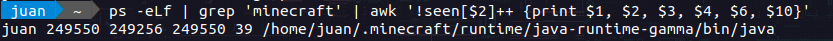
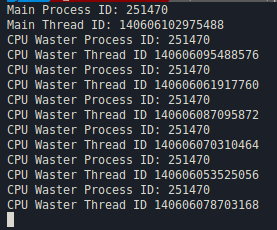
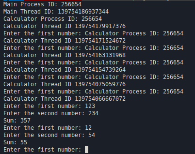
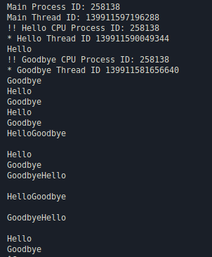

## Table of contents

- [Classwork threads](#classwork-threads)
  - [1. Check how many processes and threads your application use](#1-check-how-many-processes-and-threads-your-application-use)
  - [2. Check how many processes and threads your OS use](#2-check-how-many-processes-and-threads-your-os-use)
  - [3. Check how many processes and threads your MS Office use](#3-check-how-many-processes-and-threads-your-ms-office-use)
  - [4. Check how many processes and threads your favorite Game use](#4-check-how-many-processes-and-threads-your-favorite-game-use)
  - [5. Change the cpu\_waster function  create an application with 6 threads](#5-change-the-cpu_waster-function--create-an-application-with-6-threads)
  - [6. Change the cpu\_waster function for a calculator that adds 2 numbers entered per screen, what happens?](#6-change-the-cpu_waster-function-for-a-calculator-that-adds-2-numbers-entered-per-screen-what-happens)
  - [7. Create a program that says hello infinitely per screen, then create 2 threads, assign the greeting hello to one thread and goodbye to the other, what happens? Use std::](#7-create-a-program-that-says-hello-infinitely-per-screen-then-create-2-threads-assign-the-greeting-hello-to-one-thread-and-goodbye-to-the-other-what-happens-use-std)


# Classwork threads

`Author:` Mondalgo Tapia, Juan Carlos

`Course:` Parallel programming

This README file is designed for Linux users interested in exploring and analyzing the behavior of processes and threads within their system. It is made based on an activity "Classwork threads" from the parallel programming course

## 1. Check how many processes and threads your application use

My application created in the fifth title of this activity has a single process but 6 threads. As seen below:



The 5th number of the output of the program is the number of threads that are running on the system.

## 2. Check how many processes and threads your OS use

For this we use the command, which shows us the number of processes that are running on the system:

```bash
ps -eLf | wc -l
```



## 3. Check how many processes and threads your MS Office use

The first step is run the libreoffice application, then we check how many processes are running on the system.


For this we use the command "grep" to filter the processes that are running on the system:

```bash
ps -eLf | grep 'libreoffice' | awk '!seen[$2]++ {print $1, $2, $3, $4, $6, $10}'
```

- Using ps -eLf to list detailed information about all processes and threads.
- Filtering the output with grep 'libreoffice' to include only lines related to LibreOffice.
- Using awk to print specific fields (UID, PID, PPID, LWP, NLWP, and CMD) while ensuring that only one entry is shown for each unique PID.
  - `UID ($1)`: User ID
  - `PID ($2)`: Process ID
  - `PPID ($3)`: Parent Process ID
  - `LWP ($4)`: Thread ID
  - `NLWP ($6)`: Number of threads
  - `CMD ($10)`: Command



Then we see that there are two processes running on the system, one with PID `247892` and the other with PID `247910`. The first process has 2 threads and the second process has 5 threads.

## 4. Check how many processes and threads your favorite Game use

I don't usually play games on my computer, but I have a game called "Minecraft" installed on my computer, so I will use it for this activity.

The first step is run SKLauncher application, that is a launcher for Minecraft, then we check how many processes are running on the system.



We use a similar command to the previous one, but this time we filter the processes that are running on the system with the name "SKLauncher":

```bash
ps -eLf | grep 'SKLauncher' | awk '!seen[$2]++ {print $1, $2, $3, $4, $6, $10}'
```



And we see that there is only one process running on the system, with PID `249256` and has 56 threads.

The second step is run Minecraft application, then we check how many processes are running on the system.



We use a similar command to the previous one, but this time we filter the processes that are running on the system with the name "Minecraft":

```bash
ps -eLf | grep 'Minecraft' | awk '!seen[$2]++ {print $1, $2, $3, $4, $6, $10}'
```


And we see that there is only one process running on the system, with PID `249550` and has 39 threads.

## 5. Change the cpu_waster function  create an application with 6 threads

The source code of the program is [here](./code/05_Six_threads.cpp), in the `/code` folder. And the output of the program is the following:



If we check the processes that are running on the system, we see that there are 1 process and 7 threads running on the system.


## 6. Change the cpu_waster function for a calculator that adds 2 numbers entered per screen, what happens?

The source code of the program is [here](./code/06_Calculator.cpp), in the `/code` folder. And the output of the program is the following:



The issue i'm experiencing is likely related to contention for standard input (stdin) among different threads. Standard input can behave unexpectedly when shared among multiple threads because it is not designed to be thread-safe by default.

In C++, standard input/output operations, such as std::cin and std::cout, might lead to race conditions or unexpected behavior when used concurrently by multiple threads. A race condition occurs when two or more threads access shared data concurrently, and the behavior is dependent on the order of execution.

## 7. Create a program that says hello infinitely per screen, then create 2 threads, assign the greeting hello to one thread and goodbye to the other, what happens? Use std::

The source code of the program is [here](./code/07_Hello_GoodBye.cpp), in the `/code` folder. And the output of the program is the following:



We notice that both "Hello" and "Good bye" are sometimes printed on the same line, this is because the two threads are accessing the same variable concurrently, which can cause race conditions and is why that we see them in the same line or without a defined pattern.
