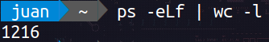
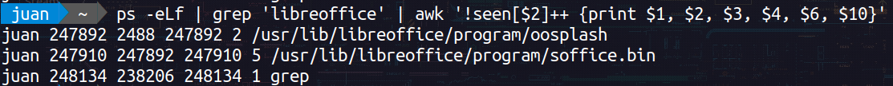
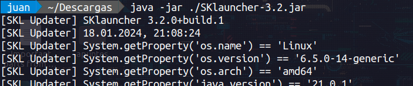
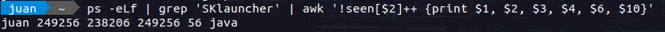
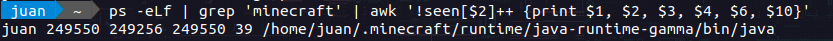

# Classwork threads

`Author:` Mondalgo Tapia, Juan Carlos

`Course:` Parallel programming

This README file is designed for Linux users interested in exploring and analyzing the behavior of processes and threads within their system. It is made based on an activity "Classwork threads" from the parallel programming course

## 1. Check how many processes and threads your application use


## 2. Check how many processes and threads your OS use

For this we use the command, which shows us the number of processes that are running on the system:

```bash
ps -eLf | wc -l
```



## 3. Check how many processes and threads your MS Office use

The first step is run the libreoffice application, then we check how many processes are running on the system.


For this we use the command "grep" to filter the processes that are running on the system:

```bash
ps -eLf | grep 'libreoffice' | awk '!seen[$2]++ {print $1, $2, $3, $4, $6, $10}'
```

- Using ps -eLf to list detailed information about all processes and threads.
- Filtering the output with grep 'libreoffice' to include only lines related to LibreOffice.
- Using awk to print specific fields (PID, PPID, TID, NLWP, and the command) while ensuring that only one entry is shown for each unique PID.



Then we see that there are two processes running on the system, one with PID `247892` and the other with PID `247910`. The first process has 2 threads and the second process has 5 threads.

## 4. Check how many processes and threads your favorite Game use

I don't usually play games on my computer, but I have a game called "Minecraft" installed on my computer, so I will use it for this activity.

The first step is run SKLauncher application, that is a launcher for Minecraft, then we check how many processes are running on the system.


We use a similar command to the previous one, but this time we filter the processes that are running on the system with the name "SKLauncher":

```bash
ps -eLf | grep 'SKLauncher' | awk '!seen[$2]++ {print $1, $2, $3, $4, $6, $10}'
```



And we see that there is only one process running on the system, with PID `249256` and has 56 threads.

The second step is run Minecraft application, then we check how many processes are running on the system.


We use a similar command to the previous one, but this time we filter the processes that are running on the system with the name "Minecraft":

```bash
ps -eLf | grep 'Minecraft' | awk '!seen[$2]++ {print $1, $2, $3, $4, $6, $10}'
```


And we see that there is only one process running on the system, with PID `249550` and has 39 threads.

